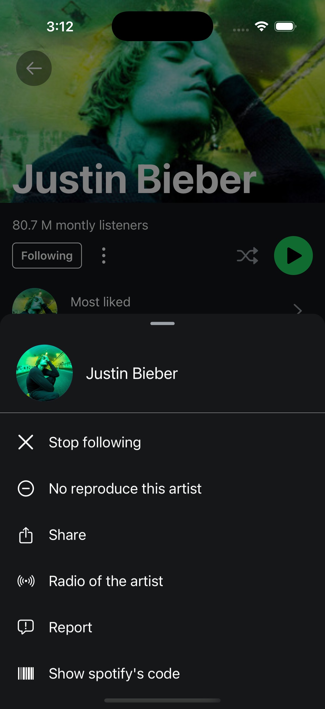

# Spotify Clone App 🎵

A modern Spotify clone built with Expo, React Native, and Firebase. This app replicates the core control features of Spotify, allowing users to manage playback, browse content, and control their Spotify experience.

## Features

- 🎧 Full Spotify playback controls (play/pause, next/previous, volume, etc.)
- 📱 Cross-platform support (iOS & Android)
- 🔐 Firebase Authentication with Google Sign-in
- 🎨 Modern UI with smooth animations
- 🔄 Real-time sync with Spotify app

## Current Status

- ✅ Firebase Authentication with Google Sign-in
- ✅ Smooth animations for modals and playback controls
- ✅ Playback controls fully implemented
- 🚧 Artist browsing (work in progress)
- 🚧 Playlist management (coming soon)

## Demo

### Screenshots

#### iOS Version

|                       Home                        |                       Playback Modal                        |                       Controllers                        |                       Playback Options                        |                       Artist Options                        |
| :-----------------------------------------------: | :---------------------------------------------------------: | :------------------------------------------------------: | :-----------------------------------------------------------: | :---------------------------------------------------------: |
|  |  |  |  |  |

#### Android Version

|                      Home Screen                      |
| :---------------------------------------------------: |
|  |

### Video Demo

|                              Click to watch demo video                               |
| :----------------------------------------------------------------------------------: |
| <a href="assets/demo/demo.mov"></a> |
|                   _Click the image above to watch the demo video_                    |

## Prerequisites

Before you begin, ensure you have:

- Node.js (v14 or later)
- npm or yarn
- Expo CLI
- iOS Simulator (for Mac users) or Android Emulator
- A Spotify Developer account
- A Firebase project with Google Sign-in enabled

## Setup

1. Clone the repository:

   ```bash
   git clone [your-repo-url]
   cd spotify-clone
   ```

2. Install dependencies:

   ```bash
   npm install
   ```

3. Create a `.env` file in the root directory with your Spotify API credentials:

   ```
   EXPO_PUBLIC_SPOTIFY_CLIENT_ID=your_spotify_client_id
   EXPO_PUBLIC_SPOTIFY_SECRET=your_spotify_client_secret
   ```

4. Add Firebase configuration:
   - For Android: Place your `google-services.json` file in the root directory
   - For iOS: Place your `GoogleService-Info.plist` file in the root directory

## Running the App

1. Start the development server:

   ```bash
   npx expo start
   ```

2. Choose your preferred method to run the app:
   - Press `i` to open in iOS simulator
   - Press `a` to open in Android emulator
   - Scan the QR code with the Expo Go app on your physical device

## Development

The app uses Expo's file-based routing system. Main components and screens are located in the `app` directory.

## Environment Variables

The following environment variables are required:

- `EXPO_PUBLIC_SPOTIFY_CLIENT_ID`: Your Spotify API client ID
- `EXPO_PUBLIC_SPOTIFY_SECRET`: Your Spotify API client secret

## Firebase Configuration

Make sure you have:

1. Created a Firebase project
2. Enabled Google Sign-in authentication
3. Added your app to the Firebase project
4. Downloaded and placed the configuration files in the correct locations

## Contributing

Feel free to submit issues and enhancement requests!

## License

This project is licensed under the MIT License - see the LICENSE file for details.
